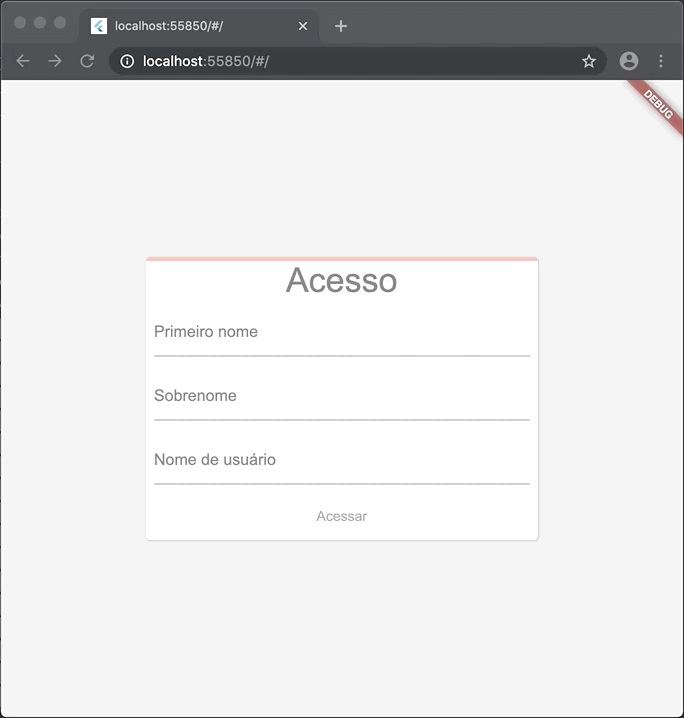

# Escreva seu primeiro aplicativo Flutter para web

Este projeto contém o código fonte codelab [Write your first Flutter app on the web](https://flutter.dev/docs/get-started/codelab-web) que foi traduzido por mim e disponibilizado em [Escreva seu primeiro aplicativo Flutter para web](ivanwhm.gitbook.io/laboratorios-de-codigo-do-flutter/escreva-seu-primeiro-aplicativo-flutter-para-web/introducao).

Todo o código foi adaptado para que você possa ter a melhor experiência em aprender Flutter sem a barreira do idioma Inglês.

Acompanhe todos os laboratórios de código Flutter traduzidos no endereço [https://ivanwhm.gitbook.io/laboratorios-de-codigo-do-flutter/](https://ivanwhm.gitbook.io/laboratorios-de-codigo-do-flutter/)

Feito com &hearts; por Ivan Wilhelm.

Codificado no [Visual Studio Code](https://code.visualstudio.com) da [Microsoft](https://www.microsoft.com.br)